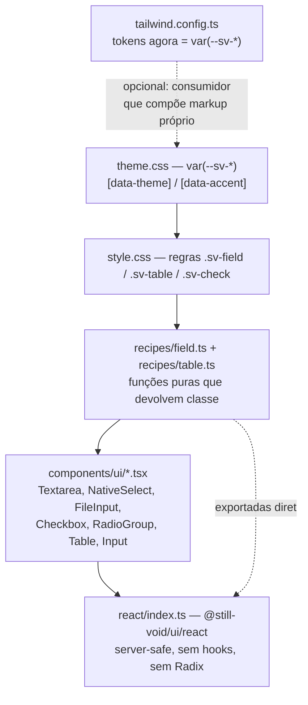

# Form & Data Primitives — Design

**Spec**: `.specs/features/form-and-data-primitives/spec.md`
**Decisões de projeto aplicáveis**: AD-001 … AD-005 (`.specs/STATE.md`)
**Status**: Draft

---

## Exploração de abordagens (feita e confirmada)

A escolha de arquitetura foi apresentada ao usuário como três opções concretas, todas entregando o mesmo escopo:

| Abordagem | Resultado | Veredito |
| --- | --- | --- |
| **A — CSS real `sv-*` + migrar `Input`** | Componentes estilizam sem Tailwind, seguem `[data-theme]`, campo tem fonte única de verdade | **Escolhida.** Única que cumpre `DESIGN.md` §7 e resolve a divergência `Input`↔`Textarea` em light |
| B — CSS real só nos novos | Menor risco de regressão | Rejeitada: `Input` (dark fixo) ao lado de `Textarea` (theme-aware) reproduz exatamente a dor relatada |
| C — Tailwind utilities + corrigir distribuição | Coerente com a camada shadcn atual | Rejeitada: mantém o lock-in em Tailwind que `DESIGN.md` §7 nomeia como anti-referência |

Registrada como **AD-001**.

---

## Architecture Overview

Três camadas, na direção que o pacote já usa para o resto do catálogo (`recipes/content.ts` → `.sv-post-card` → `<PostCard>`), e que a camada shadcn nunca seguiu:



Duas consequências que definem o desenho:

1. **Tema é resolvido em CSS, não em JS.** Nenhum componente novo lê tema, nenhum precisa de `'use client'`. `theme.css` já define `color-scheme: dark|light` no `:root`/`[data-theme='light']`, então até o chrome nativo dos controles (`<select>` aberto, check do `<input type=checkbox>`) segue o tema sem esforço — argumento forte a favor de não usar `appearance: none`.
2. **A receita é a API pública, não só detalhe interno.** `field()` é exportada de `@still-void/ui/react`, então o VittaFlow troca `nativeField` de `src/lib/ui.ts` por um import — que é o que impede a re-divergência a cada release.

---

## Code Reuse Analysis

### Existentes que a feature alavanca

| Item | Local | Como é usado |
| --- | --- | --- |
| `cn()` (clsx + tailwind-merge) | `src/lib/utils.ts` | Composição de `className` em todo `components/ui/*` — os novos seguem igual |
| `cx()` | `src/recipes/cx.ts` | Joiner puro dentro das receitas novas, como em `recipes/content.ts` |
| Padrão de receita `foo()` + `fooClasses` | `src/recipes/content.ts:13-25` | `field()`/`fieldClasses` e `table()`/`tableClasses` copiam a forma exata |
| Variáveis `--sv-*` + overrides de tema | `src/css/theme.css:18-135` | Toda regra CSS nova referencia essas vars; nenhuma var nova é criada |
| Padrão de teste de componente | `tests/ui-input.test.tsx` | Render + role/attr + ref + disabled + className merge — os testes novos seguem a mesma forma |
| Padrão de teste "CSS como texto" | `tests/tokenParity.test.ts:16-30` | Reaproveitado para os *contract tests* de `style.css` e `tailwind.config.ts` (ver Plano de Verificação) |
| Teste de barril exaustivo | `tests/shadcn-barrel.test.ts:52` | Mesma técnica (`Object.keys(...).sort()`) aplicada ao barril `react/index.ts` para pegar export esquecido |
| Port upstream shadcn `table.tsx` | consultado em `ui.shadcn.com/r/styles/new-york/table.json` | Estrutura, `displayName` e tipos são portados literalmente; só as classes trocam para `sv-*` |

### Pontos de integração

| Sistema | Integração |
| --- | --- |
| `src/react/index.ts` | Único ponto de export dos componentes novos (server-safe). Nada vai para `client/shadcn.ts` |
| `scripts/copy-css.mjs` | Passa a copiar `shadcn-overrides.css` além de `theme.css`/`style.css` |
| `package.json` `exports`/`files` | Ganha `./tailwind-preset` e `./shadcn-overrides.css`; `files` ganha o preset |
| Storybook | Uma story por componente novo, seguindo `src/react/stories/Input.stories.tsx` |
| Changesets | Dois arquivos: `minor` (componentes/receitas/exports) e `patch` (D1–D5) |

---

## Components

### `field()` — receita de campo

- **Purpose**: devolver a classe da moldura de campo, única fonte de verdade compartilhada por `Input`, `Textarea`, `NativeSelect` e `FileInput`.
- **Location**: `src/recipes/field.ts`
- **Interfaces**:
  ```ts
  export type FieldVariant = 'input' | 'textarea' | 'select' | 'file';
  export interface FieldOptions { variant?: FieldVariant }
  export function field(options?: FieldOptions): string;   // 'sv-field' | 'sv-field sv-field--textarea' | ...
  export const fieldClasses: { readonly choice: 'sv-choice'; readonly srOnly: 'sv-sr-only' } ;
  ```
  `variant: 'input'` (ou omitido) devolve só `sv-field` — sem modificador redundante.
- **Dependencies**: `cx`
- **Reuses**: forma de `categoryPill()` em `recipes/content.ts`

### `table()` — receita de tabela

- **Purpose**: classes da família de tabela, para quem compõe `<table>` cru em vez de usar os componentes.
- **Location**: `src/recipes/table.ts`
- **Interfaces**:
  ```ts
  export function table(): string;   // 'sv-table'
  export const tableClasses: {
    readonly container: 'sv-table-container'; readonly head: 'sv-table__head';
    readonly body: 'sv-table__body'; readonly foot: 'sv-table__foot';
    readonly row: 'sv-table__row'; readonly th: 'sv-table__th';
    readonly td: 'sv-table__td'; readonly caption: 'sv-table__caption';
  };
  ```

### `Textarea`

- **Purpose**: par do `Input` para texto multilinha. **FDP-01**
- **Location**: `src/components/ui/textarea.tsx`
- **Interfaces**: `TextareaProps extends React.TextareaHTMLAttributes<HTMLTextAreaElement>`; `forwardRef<HTMLTextAreaElement>`
- **Renderiza**: `<textarea class={cn(field({variant:'textarea'}), className)}>`; `rows` passa direto (é o atributo que motivou a lacuna).

### `NativeSelect`

- **Purpose**: `<select>` de formulário, serializável e drop-in. **FDP-02**, **AD-003**
- **Location**: `src/components/ui/native-select.tsx`
- **Interfaces**: `NativeSelectProps extends React.SelectHTMLAttributes<HTMLSelectElement>`; `forwardRef<HTMLSelectElement>`; `children` são `<option>`/`<optgroup>`
- **Nota de desenho**: **não** usa `appearance: none`. A seta nativa e o list box do SO seguem `color-scheme` do `theme.css`, o que dá tema correto de graça e mantém `multiple` funcionando — coisas que uma seta desenhada por `background-image` quebraria.

### `FileInput`

- **Purpose**: `<input type="file">` com o botão nativo estilizado. **FDP-03**
- **Location**: `src/components/ui/file-input.tsx`
- **Interfaces**: `FileInputProps extends Omit<React.InputHTMLAttributes<HTMLInputElement>, 'type'>`; `forwardRef<HTMLInputElement>`
- **Nota de desenho**: `type` sai do tipo **e** é fixado no JSX depois do spread — `Omit` protege o TS, a ordem do JSX protege o runtime (`{...props}` antes de `type="file"`), cobrindo o consumidor JS sem tipos. Estilo do botão via `::file-selector-button`, com `-webkit-file-upload-button` como fallback.

### `Checkbox`

- **Purpose**: `<input type="checkbox">` do sistema, server-safe. **FDP-06**, **AD-002**
- **Location**: `src/components/ui/checkbox.tsx`
- **Interfaces**: `CheckboxProps extends Omit<React.InputHTMLAttributes<HTMLInputElement>, 'type'>`; `forwardRef<HTMLInputElement>`
- **Renderiza**: `<input type="checkbox" class={cn('sv-check', className)}>`, sem wrapper — quem quiser rótulo usa `<label>` próprio ou o wrapper `sv-choice`.

### `RadioGroup` / `RadioGroupItem`

- **Purpose**: grupo de rádios acessível, sem boundary client. **FDP-07**, **FDP-08**
- **Location**: `src/components/ui/radio-group.tsx`
- **Interfaces**:
  ```ts
  interface RadioGroupProps extends Omit<React.FieldsetHTMLAttributes<HTMLFieldSetElement>, 'name'> {
    legend?: React.ReactNode;
    legendHidden?: boolean;
    orientation?: 'vertical' | 'horizontal';   // default 'vertical'
    name?: string;
  }
  interface RadioGroupItemProps extends Omit<React.InputHTMLAttributes<HTMLInputElement>, 'type'> {
    children?: React.ReactNode;   // vira o rótulo
  }
  ```
- **Propagação de `name`**: `React.Children.map` sobre os filhos; injeta `name` apenas quando `React.isValidElement(child) && child.type === RadioGroupItem` **e** o filho não declara `name` próprio. Qualquer outro filho passa intacto. Sem context — `createContext` não existe em Server Component (AD-002).
- **Renderiza**: `<fieldset class="sv-radio-group[--horizontal]"><legend class="sv-radio-group__legend [sv-sr-only]">…</legend>{children}</fieldset>`. `RadioGroupItem` renderiza `<label class="sv-choice"><input type="radio" class="sv-radio">{children}</label>` — o input fica *dentro* do label, o que dá associação implícita sem precisar gerar `id` (importante: gerar id exigiria `useId`, que é hook, que quebraria server-safety).

### Família `Table`

- **Purpose**: tabela de dados apresentacional. **FDP-09**, **FDP-10**, **FDP-11**
- **Location**: `src/components/ui/table.tsx`
- **Exports**: `Table`, `TableHeader`, `TableBody`, `TableFooter`, `TableRow`, `TableHead`, `TableCell`, `TableCaption` — todos `forwardRef`, todos com `displayName`.
- **`Table` extra prop**: `containerClassName?: string` — o wrapper de rolagem e o `<table>` são alvos separados (FDP-10).

### `Input` (migração)

- **Location**: `src/components/ui/input.tsx` — **FDP-05**
- **Mudança**: a string de utilitárias Tailwind vira `cn(field(), className)`. Props, tipos, `displayName` e `forwardRef` intocados. Único valor visual alterado: `font-size` (AD-004).

---

## Contrato de CSS (`src/css/style.css` — seções novas)

Escrito para bater com o render atual do `Input` token a token. `1px` de borda é o único literal (não há token de largura de borda no sistema, e o resto de `style.css` já usa `1px` literal).

```css
/* ---------- Forms ---------- */
.sv-field {
  display: block;                       /* era `flex`; `block` é o correto para controle nativo */
  width: 100%;
  height: var(--sv-space-10);           /* 40px — era h-10 */
  padding: var(--sv-space-2) var(--sv-space-3);   /* 8px 12px — era py-2 px-3 */
  border: 1px solid var(--sv-border);
  border-radius: var(--sv-radius-sm);   /* 6px — era rounded-md (default Tailwind) */
  background: var(--sv-surface);
  color: var(--sv-text);
  font-family: var(--sv-font-body);
  font-size: var(--sv-text-base);       /* AD-004: única mudança de valor */
  line-height: 1.5;
}
.sv-field::placeholder { color: var(--sv-text-2); }
.sv-field:focus-visible {               /* AD-005 / D5 — hoje não há foco visível */
  outline: 2px solid var(--sv-accent-ink);
  outline-offset: 2px;
}
.sv-field:disabled { cursor: not-allowed; opacity: 0.5; }

.sv-field--textarea { height: auto; min-height: calc(var(--sv-space-10) * 2); resize: vertical; }
.sv-field--select[multiple] { height: auto; }
.sv-field--file { height: auto; padding: var(--sv-space-1) var(--sv-space-2); }
.sv-field--file::file-selector-button { /* + ::-webkit-file-upload-button */
  margin-inline-end: var(--sv-space-3);
  padding: var(--sv-space-1) var(--sv-space-3);
  border: 1px solid var(--sv-border);
  border-radius: var(--sv-radius-sm);
  background: var(--sv-surface-2);
  color: var(--sv-text);
  font: inherit;
  cursor: pointer;
}

.sv-check, .sv-radio {
  width: var(--sv-space-4); height: var(--sv-space-4);   /* 16px */
  accent-color: var(--sv-accent-ink);   /* -ink: ≥3:1 sobre superfície clara também */
  margin: 0; cursor: pointer;
}
.sv-check:focus-visible, .sv-radio:focus-visible { outline: 2px solid var(--sv-accent-ink); outline-offset: 2px; }
.sv-check:disabled, .sv-radio:disabled { cursor: not-allowed; opacity: 0.5; }

.sv-choice { display: inline-flex; align-items: center; gap: var(--sv-space-2); cursor: pointer; color: var(--sv-text); }
.sv-radio-group { border: 0; margin: 0; padding: 0; display: flex; flex-direction: column; gap: var(--sv-space-2); }
.sv-radio-group--horizontal { flex-direction: row; flex-wrap: wrap; gap: var(--sv-space-4); }
.sv-radio-group__legend { padding: 0; margin-bottom: var(--sv-space-2); color: var(--sv-text-2); font-size: var(--sv-text-sm); }
.sv-sr-only { position: absolute; width: 1px; height: 1px; padding: 0; margin: -1px; overflow: hidden; clip-path: inset(50%); white-space: nowrap; border: 0; }

/* ---------- Table ---------- */
.sv-table-container { width: 100%; overflow-x: auto; }
.sv-table { width: 100%; border-collapse: collapse; caption-side: bottom; font-size: var(--sv-text-sm); color: var(--sv-text); }
.sv-table__head { background: var(--sv-bg); }
.sv-table__th {
  height: var(--sv-space-10); padding: 0 var(--sv-space-3); text-align: start;
  font-size: var(--sv-text-xs); text-transform: uppercase; letter-spacing: 0.04em;
  color: var(--sv-text-3); font-weight: 600; border-bottom: 1px solid var(--sv-border);
}
.sv-table__td { padding: var(--sv-space-3); vertical-align: middle; }
.sv-table__row { border-bottom: 1px solid var(--sv-border); transition: background var(--sv-duration-fast) var(--sv-ease-hover); }
.sv-table__body .sv-table__row:last-child { border-bottom: 0; }
.sv-table__row:hover { background: var(--sv-surface-2); }
.sv-table__foot { border-top: 1px solid var(--sv-border); background: var(--sv-surface); font-weight: 600; }
.sv-table__caption { margin-top: var(--sv-space-4); color: var(--sv-text-2); font-size: var(--sv-text-sm); }
```

Note que o cabeçalho reproduz literalmente o que o relatório diz que as 12 telas do VittaFlow repetem à mão (`border-b bg-bg text-xs uppercase text-ink-3` + `divide-y divide-border`) — a decoração deixa de ser copiada e passa a ser herdada.

---

## Correções de defeito

| ID | Arquivo | Mudança |
| --- | --- | --- |
| **SVD-01** (D1) | `tailwind.config.ts` | Cada cor do sistema vira `var(--sv-*)`: `'sv-surface': 'var(--sv-surface)'`, `'sv-border': 'var(--sv-border)'`, `'sv-text': 'var(--sv-text)'`, acentos → `var(--sv-accent-*)`. A troca de tema passa a se propagar para toda a camada shadcn, migrada ou não |
| **SVD-02** | `tailwind.config.ts` | Remove os 9 aliases `*-light` — viraram inertes, porque a var já troca sozinha. Declarado no changeset |
| **SVD-03** (D2) | `package.json` | `files` ganha `tailwind-preset.js`+`.d.ts` (build do `tailwind.config.ts` via tsup) e `exports` ganha `./tailwind-preset` |
| **SVD-04** (D3) | `package.json` | `peerDependencies.tailwindcss` + `peerDependenciesMeta.tailwindcss.optional: true` |
| **SVD-05** (D4) | `scripts/copy-css.mjs`, `package.json` | Copia `shadcn-overrides.css` para `dist/` e adiciona o subpath `./shadcn-overrides.css` |
| **SVD-06** (D5) | `src/css/style.css` | `.sv-field:focus-visible` com `outline` real (AD-005) |

---

## Plano de Verificação (jsdom não carrega CSS — isto é deliberado)

`vitest` roda em jsdom sem `style.css` carregado, então `getComputedStyle` **não** resolve `var(--sv-*)`. Asserção de cor por computed style seria teatro. A verificação se divide em dois níveis, ambos com precedente no repo (`tests/tokenParity.test.ts`):

| Nível | O que assegura | Arquivos de teste |
| --- | --- | --- |
| **DOM/comportamento** | Elemento nativo correto, roles ARIA, atributos, `ref`, `disabled`, composição de `className`, serialização em `FormData`, propagação de `name`, `type` blindado | `tests/ui-textarea.test.tsx`, `ui-native-select`, `ui-file-input`, `ui-checkbox`, `ui-radio-group`, `ui-table`, `ui-input` (estendido), `forms-integration.test.tsx` |
| **Contrato de CSS/config (texto)** | Toda regra `sv-field`/`sv-table`/`sv-check` existe; nenhuma delas contém literal hex/oklch; `tailwind.config.ts` não tem mais hex; `copy-css.mjs` copia os 3 CSS; `package.json` declara os subpaths e o peer | `tests/field-css-contract.test.ts`, `tests/package-contract.test.ts` |

Cobertura: thresholds do repo são **100%** em lines/branches/functions/statements sobre `src/**`. Cada branch das receitas (cada `FieldVariant`, `orientation`, `legendHidden`) e cada caminho do `Children.map` (item sem `name`, item com `name`, filho não-`RadioGroupItem`, filho `null`) precisa de teste nomeado — estão listados como AC na spec justamente para isso.

Teste de barril: `tests/react-barrel.test.ts` afirma `Object.keys(reactIndex).sort()` contra a lista esperada, pegando export esquecido nos dois sentidos (**FDP-13**).

---

## Risks & Concerns

| Concern | Local | Impacto | Mitigação |
| --- | --- | --- | --- |
| `shadcn-overrides.css` usa `!important` em seletores de elemento (`button`, `input`, `select`, `textarea`) e um catch-all `[class*="shadow"]` | `src/css/shadcn-overrides.css:18-97` | Publicar a folha (SVD-05) espalha `box-shadow: none !important` para **todo** `button`/`input` da app do consumidor, não só os do pacote | Publicar como subpath **opt-in** (`@still-void/ui/shadcn-overrides.css`), nunca importado por `style.css`; documentar o escopo agressivo. Registrado como candidato a reescrita escopada em feature própria |
| Nenhum teste hoje cobre o comportamento visual em `[data-theme='light']` | `tests/**` | D1 passou despercebido até o relatório do consumidor | Contract tests de CSS/config (SVD-01) fecham a porta na origem: hex literal no config quebra o build |
| `tailwind.config.ts` declara `tailwindcss ^4` em devDeps mas usa formato de config v3 | `package.json:devDependencies`, `tailwind.config.ts` | Preset publicado pode não ser consumível por quem está em v4 CSS-first | Fora de escopo desta spec (declarado). O preset é publicado no formato que já existe; a normalização v4 vira item de backlog |
| `Input` é usado nas stories e possivelmente em `react-components*.test.tsx` | `src/react/stories/Input.stories.tsx`, `tests/react-components*.test.tsx` | Migração pode quebrar teste existente | AC P2-4 é explícito: se um teste existente precisar de edição, é regressão de API, não migração. Rodar a suíte antes de tocar em qualquer teste |
| `React.Children.map` + `cloneElement` é acoplamento a filhos diretos | `src/components/ui/radio-group.tsx` (novo) | Item dentro de wrapper silenciosamente perde o `name` | Comportamento é AC explícito (P1-Escolhas #8), testado, e documentado no catálogo. Escape hatch existe: `name` no próprio item |
| Migração P2 (`Button`/`Card`/`Alert`/`Badge`) tem variantes com CVA-like strings | `src/components/ui/button.tsx`, `badge.tsx`, `alert.tsx` | Converter variantes para CSS pode perder uma variante silenciosamente | Teste de paridade de variantes: cada nome de variante existente vira caso de teste antes da migração |

---

## Tech Decisions

| Decisão | Escolha | Racional |
| --- | --- | --- |
| Seta do `<select>` | Mantém a nativa (sem `appearance: none`) | `color-scheme` do `theme.css` já faz o chrome nativo seguir o tema; desenhar a seta quebraria `multiple` e exigiria data-URI com cor fixa |
| Associação rótulo↔input no `RadioGroupItem` | Input **dentro** do `<label>` | Associação implícita, sem `id` gerado — `useId` é hook e quebraria server-safety (AD-002) |
| `display` do `.sv-field` | `block`, não `flex` | O `flex` herdado do shadcn não faz nada em controle nativo (sem filhos); `block` + `width:100%` reproduz o mesmo box |
| `accent-color` | `var(--sv-accent-ink)`, não `var(--sv-accent)` | `--sv-accent` em light mode continua no valor claro (oklch 0.78) e falharia 3:1 de contraste não-textual sobre branco |
| `field()` como export público | Sim, de `@still-void/ui/react` | É o substituto direto do `nativeField` local do VittaFlow — sem isso o consumidor continua espelhando estilo à mão |
| Componentes novos não vão para `client/shadcn.ts` | Todos em `react/index.ts` | AD-002 — nenhum tem estado |
| Dois changesets | `minor` (features) + `patch` (D1–D5) | Consumidor lendo o changelog precisa distinguir "ganhei componente" de "meu campo agora tem foco visível e segue o tema" |
