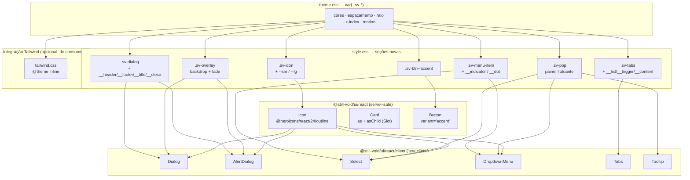

# Rodada 2 — Design

**Spec**: [spec.md](spec.md)
**Status**: Draft
**Decisões ativas que restringem este design**: AD-001 (CSS `sv-*` é o mecanismo de estilo), AD-002 (server-safe por default, Radix só quando o nativo não dá conta), AD-004 (reancorar valor herdado do Tailwind é `patch`), AD-005 (foco é `outline`, nunca `box-shadow`/`ring`), AD-006 (`as` **e** `asChild`, `asChild` vence), AD-007 (divergência doc↔artefato resolve-se agregando), AD-009 (fade mínimo por `[data-state]`), AD-010 (componente `Icon` + set curado — fonte superseded), AD-011 (`tailwind.css` só `@theme`), AD-012 (Tailwind v4-only, `v3.0.0`), AD-013 (`@heroicons/react`).

---

## Architecture Overview

A rodada 2 repete a jogada da rodada 1 — **classe CSS real no lugar de utilitária** — mas agora sobre a família
que vive atrás de portal. A diferença estrutural é que os cinco componentes client compartilham superfícies
visuais entre si (overlay, painel flutuante, item de lista), então o CSS ganha **primitivas compartilhadas**
em vez de um bloco fechado por componente — o mesmo desenho que `.sv-field` já usa para quatro campos.



**Por que `@theme inline` e não `@theme`:** confirmado na doc oficial do Tailwind v4 — quando uma variável de
tema referencia **outra** custom property que muda de escopo (é literalmente o exemplo `[data-theme="dark"]`
da doc), sem o modificador `inline` a utilitária emite `var(--color-sv-bg)` e a resolução quebra fora do
escopo em que a variável foi declarada. Como o pacote inteiro depende de `[data-theme]`/`[data-accent]`
reescreverem `--sv-*`, `@theme inline` é requisito de correção, não estilo.

---

## Code Reuse Analysis

### O que já existe e vai ser aproveitado

| Peça | Local | Como usar |
| --- | --- | --- |
| Padrão `.sv-field` (frame único para 4 componentes) | `src/css/style.css:603` | Mesmo desenho aplicado a `.sv-pop` e `.sv-menu-item` |
| Modificadores `.sv-btn--*` | `src/css/style.css` | `--accent` entra como mais um irmão, sem tocar na base |
| Bloco `@media (prefers-reduced-motion: reduce)` | `src/css/theme.css:234` | Ganha os seletores novos de `[data-state]` |
| Tokens de z-index (`--sv-z-modal`, `--sv-z-backdrop`, `--sv-z-tooltip`, `--sv-z-dropdown`) | `src/css/theme.css:90` | Substituem os `z-50` literais |
| `.sv-sr-only` | `src/css/style.css` | Texto "Close" do botão de fechar do `Dialog` |
| Parser seletor→corpo dos testes de contrato | `tests/component-css-contract.test.ts` | Base dos contratos novos — discrimina, ao contrário de `toContain` |
| Walker do grafo de imports | `tests/server-safety.test.ts` | Estendido para resolver também especificador **bare** (ICON-07) |
| `cn()` (clsx + tailwind-merge) | `src/lib/utils.ts` | Mantido: o consumidor continua passando utilitária dele via `className` |
| Família `Dialog` migrada | `src/components/ui/dialog.tsx` | `AlertDialog` reusa CSS e estrutura, trocando o primitivo do Radix |
| `SelectPrimitive.ItemText` / `ItemIndicator` / `Icon` | `@radix-ui/react-select` (verificado no dist) | Fecham o trigger em branco e o `pl-8` órfão |
| `DropdownMenuPrimitive.ItemIndicator` | `@radix-ui/react-dropdown-menu` (verificado) | Indicador de checkbox/radio |
| `@radix-ui/react-slot@1.3.3` | já presente como transitiva | Promovido a dep direta para o `asChild` do `Card` |

### Pontos de integração

| Sistema | Integração |
| --- | --- |
| `scripts/copy-css.mjs` | Ganha a cópia de `src/css/tailwind.css` → `dist/tailwind.css` |
| `package.json` `exports` | Ganha `./tailwind.css`; **perde** `./tailwind-preset` |
| `tsup.config.ts` | Perde a entry `tailwind-preset` (e o `cjsInterop` que existia só por causa dela) |
| Storybook | `Icon` ganha story; stories de Dialog/Select seguem funcionando sem mudança de API |

---

## Components

### `Icon`

- **Purpose**: expor um set curado de ícones com tamanho, cor e a11y padronizados pelo design system.
- **Location**: `src/components/ui/icon.tsx` + set em `src/components/ui/icon-set.ts`
- **Interfaces**:
  ```ts
  export type IconName =
    | 'x' | 'check' | 'chevron-down' | 'chevron-up' | 'chevron-right' | 'chevron-left'
    | 'info' | 'alert-triangle' | 'alert-circle' | 'check-circle'
    | 'copy' | 'sun' | 'moon' | 'search' | 'menu';

  export interface IconProps extends Omit<React.SVGProps<SVGSVGElement>, 'ref'> {
    name: IconName;
    size?: 'sm' | 'md' | 'lg';   // default 'md'
    label?: string;              // quando presente: role="img" + aria-label
  }
  ```
- **Dependencies**: `@heroicons/react/24/outline` (import nomeado por ícone), `cn`
- **Reuses**: `.sv-icon` novo em `style.css`; nenhum hook, nenhum contexto — server-safe por construção
- **Nota de implementação**: o mapa `IconName → componente` é um `Record` literal de imports estáticos. Nome
  fora da union em runtime cai no ícone default via `?? fallback` (ICON-05), o que também é o que mantém a
  cobertura de branch em 100%.

### Seções novas de `style.css`

| Seção | Classes | Serve |
| --- | --- | --- |
| `/* ---------- Icons ---------- */` | `.sv-icon`, `.sv-icon--sm`, `.sv-icon--lg` | `Icon` |
| `/* ---------- Overlays ---------- */` | `.sv-overlay` | `Dialog`, `AlertDialog` |
| `/* ---------- Popovers ---------- */` | `.sv-pop`, `.sv-pop__viewport`, `.sv-pop__scroll` | `Select`, `DropdownMenu`, `Tooltip` |
| `/* ---------- Menu items ---------- */` | `.sv-menu-item`, `.sv-menu-item--inset`, `.sv-menu-item__indicator`, `.sv-menu-item__dot`, `.sv-menu-label`, `.sv-menu-separator`, `.sv-menu-shortcut` | `Select`, `DropdownMenu` |
| `/* ---------- Dialog ---------- */` | `.sv-dialog`, `.sv-dialog__header`, `.sv-dialog__footer`, `.sv-dialog__title`, `.sv-dialog__description`, `.sv-dialog__close` | `Dialog`, `AlertDialog` |
| `/* ---------- Tabs ---------- */` | `.sv-tabs`, `.sv-tabs__list`, `.sv-tabs__trigger`, `.sv-tabs__content` | `Tabs` |
| `/* ---------- Tooltip ---------- */` | `.sv-tooltip` (só o que difere de `.sv-pop`) | `Tooltip` |
| Adição em `/* ---------- Buttons ---------- */` | `.sv-btn--accent` | `Button` |

Regra de motion, uma vez só, aplicada a `.sv-overlay`, `.sv-pop`, `.sv-dialog`:

```css
[data-state='closed'] { opacity: 0; }
[data-state='open']   { opacity: 1; }
/* transition: opacity var(--sv-duration-fast) var(--sv-ease-hover); */
```
…sempre com o seletor ancorado na classe do sistema (`.sv-pop[data-state='open']`), nunca em `[data-state]`
solto, que alcançaria marcação do consumidor.

### `Dialog` (migrado)

- **Purpose**: manter o comportamento Radix, trocar a camada visual e fechar GAP-07/GAP-08.
- **Location**: `src/components/ui/dialog.tsx`
- **Interfaces**: iguais às atuais, mais
  ```ts
  interface DialogContentProps extends React.ComponentPropsWithoutRef<typeof DialogPrimitive.Content> {
    showCloseButton?: boolean; // default true
  }
  ```
- **Dependencies**: `@radix-ui/react-dialog`, `Icon`
- **Reuses**: `.sv-overlay`, `.sv-dialog`, `.sv-sr-only`
- **Mudanças**: `aria-modal="true"` explícito no `Content`; botão `.sv-dialog__close` com `<Icon name="x" />`
  e `<span className="sv-sr-only">Close</span>`, envolvido em `DialogPrimitive.Close`.

### `AlertDialog` (novo)

- **Purpose**: confirmação destrutiva acessível.
- **Location**: `src/components/ui/alert-dialog.tsx`
- **Interfaces**: `AlertDialog`, `AlertDialogTrigger`, `AlertDialogPortal`, `AlertDialogOverlay`,
  `AlertDialogContent`, `AlertDialogHeader`, `AlertDialogFooter`, `AlertDialogTitle`,
  `AlertDialogDescription`, `AlertDialogAction`, `AlertDialogCancel` — os 11 exports verificados no dist do Radix.
- **Dependencies**: `@radix-ui/react-alert-dialog` (já em `dependencies`, hoje sem uso)
- **Reuses**: exatamente as mesmas classes do `Dialog` — nenhum bloco de CSS novo. `Action`/`Cancel` não
  ganham estilo próprio: o consumidor compõe com `Button` (`variant="destructive"` / `variant="outline"`).
- **Diferença deliberada**: sem botão de fechar em `X` (ALERT-04).

### `Select` (migrado)

- **Purpose**: fechar o trigger em branco, o `pl-8` órfão e as classes mortas.
- **Location**: `src/components/ui/select.tsx`
- **Mudanças**:
  1. `SelectItem` passa a renderizar `<SelectPrimitive.ItemIndicator>` + `<SelectPrimitive.ItemText>` —
     **é o defeito CLIENT-13**, verificado na fonte: `ItemText` faz `createPortal(children, valueNode)`
  2. `SelectTrigger` renderiza `<SelectPrimitive.Icon>` com `<Icon name="chevron-down" />`
  3. Botões de scroll ganham `chevron-up`/`chevron-down`
  4. Prop `icon?: React.ReactNode` em `SelectTrigger` e `SelectItem`; `icon={null}` colapsa o slot
- **Reuses**: `.sv-field` (o trigger é um campo de formulário — mesmo frame do `NativeSelect`), `.sv-pop`, `.sv-menu-item`

### `DropdownMenu` (migrado)

- **Location**: `src/components/ui/dropdown-menu.tsx`
- **Mudanças**: `CheckboxItem`/`RadioItem` renderizam `ItemIndicator` (check / `.sv-menu-item__dot`);
  `SubTrigger` ganha `chevron-right`; prop `icon` nos três; `inset` vira `.sv-menu-item--inset`
- **Reuses**: `.sv-pop`, `.sv-menu-item` e irmãos

### `Tabs` e `Tooltip` (migrados)

- Troca direta de utilitária por `.sv-tabs*` / `.sv-tooltip`; `TabsTrigger` perde `shadow-sm` e ganha foco por
  `outline` (AD-005). Sem mudança de API.

### `Button` e `Card`

- `Button`: soma `variant === 'accent' && 'sv-btn--accent'` à union e ao `cn`. Nada mais muda.
- `Card`:
  ```ts
  type CardElement = 'div' | 'section' | 'article' | 'li' | 'aside';
  interface CardProps extends React.HTMLAttributes<HTMLElement> {
    as?: CardElement;      // default 'div'
    asChild?: boolean;     // vence `as` quando ambos (AD-006)
  }
  ```
  Implementação: `const Comp = asChild ? Slot : (as ?? 'div')`. Valor fora da union em runtime cai em `'div'`
  por lookup em um `Set` de tags permitidas (CARD-06) — não `as any` direto no JSX, que renderizaria
  `<qualquercoisa>`.

### `src/css/tailwind.css` (novo)

```css
@theme inline {
  --color-sv-bg: var(--sv-bg);
  /* … um par por token de cor, fonte, espaçamento e raio … */
}
```
Sem `@source`, sem aliases mortos (AD-011). Copiado para `dist/` por `scripts/copy-css.mjs`.

### Testes novos e alterados

| Arquivo | O que faz |
| --- | --- |
| `tests/ui-icon.test.tsx` | ICON-01..05 — tag, classes, `aria-hidden` vs `role="img"`, fallback |
| `tests/icon-css-contract.test.ts` | `.sv-icon*` com tamanho por token, sem px literal |
| `tests/client-css-contract.test.ts` | CLIENT-02/04/08/11 — parser seletor→corpo sobre as seções novas |
| `tests/client-class-contract.test.tsx` | CLIENT-01 — renderiza os 6 e afirma que **nenhuma** classe emitida está fora do prefixo `sv-` |
| `tests/ui-alert-dialog.test.tsx` | ALERT-01..05 |
| `tests/tailwind-css-contract.test.ts` | TW-01/02/05 — `@theme inline`, paridade com `theme.css`, ausência dos aliases |
| `tests/server-safety.test.ts` | **estendido** — resolve bare specifier e varre o `dist` da dependência (ICON-07) |
| `tests/ui-dialog/select/tabs/tooltip/dropdown-menu` | **não mudam** (CLIENT-12); ganham arquivos irmãos para o comportamento novo |
| `tests/package-contract.test.ts` | perde os blocos de preset, ganha os de `tailwind.css` — remoção intencional (AD-012) |
| `tests/tailwind-config-contract.test.ts` | **removido** — o artefato que ele testa deixa de existir (AD-012) |

---

## Error Handling Strategy

| Cenário | Tratamento | Impacto no consumidor |
| --- | --- | --- |
| `Icon name` fora da union em runtime | Fallback para o ícone default, sem `throw` | Renderiza um ícone genérico em vez de quebrar a página |
| `Card as` fora da union em runtime | Lookup em `Set` de tags permitidas → `'div'` | HTML válido, sem elemento inventado |
| `Card asChild` com múltiplos filhos | Comportamento do `Slot` do Radix (erro explícito) | Erro em dev, na hora, com mensagem do Radix |
| Consumidor sem Tailwind | Nada acontece — nenhum componente depende dele | Renderiza normal (é o objetivo da rodada) |
| Consumidor em Tailwind v3 | `npm install` avisa peer incompatível | Precisa migrar para v4 ou ficar na `2.x` (AD-012) |
| `prefers-reduced-motion` | Transição zerada por media query | Abrir/fechar instantâneo |

---

## Risks & Concerns

| Concern | Local | Impacto | Mitigação |
| --- | --- | --- | --- |
| `shadcn-overrides.css` tem catch-all `[class*="shadow"] { box-shadow: none !important }` | `src/css/shadcn-overrides.css:95` | Mascara qualquer `box-shadow` que vaze — inclusive um que a rodada devesse pegar. Faz o teste visual mentir para quem importa a folha opt-in | Contrato CLIENT-04 é **texto sobre `style.css`**, não `getComputedStyle` — não depende da folha opt-in estar carregada |
| Walker de `server-safety` ignora `node_modules` | `tests/server-safety.test.ts:63` | Uma dep com `'use client'` entra no entry server-safe sem nenhum teste reclamar — foi o que quase aconteceu com o `lucide-react` | ICON-07: estender o walker para resolver bare specifier e varrer o `dist` da dep |
| `SelectItem` sem `ItemText` | `src/components/ui/select.tsx:88` | Trigger em branco após escolher — defeito **user-visible** que nenhum teste atual pega (`tests/ui-select.test.tsx` não seleciona valor) | CLIENT-13 + teste que seleciona e afirma o texto no trigger |
| Cobertura exigida é 100% em 4 métricas | `vitest.config.ts:14` | Qualquer branch nova sem teste **derruba o CI**, não só avisa | Cada prop nova (`size`, `label`, `as`, `asChild`, `icon`, `showCloseButton`) entra com teste dos dois lados do branch, na mesma task |
| `tailwind-merge` continua em `dependencies` sem função interna | `src/lib/utils.ts:2` | ~5 KB no bundle para mesclar classes que o pacote não emite mais | **Mantido de propósito**: o consumidor continua passando utilitária dele via `className`, e `cn` precisa desempatar. Remover seria `major` sem ganho |
| `@heroicons/react` na grade `24/outline` escalado para 16 px | `.sv-icon--sm` | Heroicons redesenha os traços por grade; escalar 24→16 perde nitidez em tela de baixa densidade | Aceito e registrado — trocar de grade por tamanho está fora de escopo. `.sv-icon` usa `stroke-width` do sistema, o que compensa parte |
| Stories de Storybook não são cobertas por teste | `src/react/stories/*` | Story quebrada só aparece no build do Storybook | `npm run build-storybook` fica como verificação da fase final |
| `AlertDialog` sai com 0 call sites | catálogo | API pública nova sem uso real para exercitar o desenho | Story + teste de comportamento; AD-007 já aceitou esse custo explicitamente |

---

## Tech Decisions

| Decisão | Escolha | Racional |
| --- | --- | --- |
| Organização do CSS client | Primitivas compartilhadas (`.sv-overlay`, `.sv-pop`, `.sv-menu-item`) + blocos específicos | Decisão do usuário em 2026-08-24. Mesmo desenho do `.sv-field`, que já serve 4 campos |
| Modificador do `@theme` | `@theme inline` | Confirmado na doc oficial do Tailwind v4: sem `inline`, variável de tema que referencia outra custom property com escopo (`[data-theme]`) não resolve |
| Seletor de estado | `.sv-pop[data-state='open']`, nunca `[data-state]` solto | Seletor solto alcança marcação do consumidor — é o erro que torna `shadcn-overrides.css` opt-in |
| Frame do `SelectTrigger` | Reusa `.sv-field` | O trigger **é** um campo; compartilhar o frame é o que faz `Select` e `NativeSelect` parecerem o mesmo controle (AD-003 diz que coexistem, não que divergem) |
| Indicador de rádio no menu | Círculo em CSS (`.sv-menu-item__dot`) | O set do heroicons não tem ponto na grade certa; um círculo é 3 linhas de CSS e sempre alinhado ao token |
| Ícone substituível | Prop `icon?: React.ReactNode` com `null` colapsando o slot | Decisão do usuário: default sim, camisa de força não |
| `Card` com `as` inválido | Lookup em `Set` de tags permitidas | `as any` direto no JSX renderiza `<qualquercoisa>` — HTML inválido silencioso |
| Ordem das fases | Ícones → CSS → Dialog/Tabs/Tooltip → Select/Dropdown → AlertDialog → Button/Card → Tailwind/docs | Cada fase depende da anterior; `tailwind.css` por último porque só aí o pacote já não emite utilitária |

---

## Fases previstas (entram na fase Tasks)

| Fase | Escopo | Requisitos |
| --- | --- | --- |
| 1 | `Icon`, `.sv-icon`, endurecer `server-safety` | ICON-01..07 |
| 2 | Primitivas CSS compartilhadas + contratos | CLIENT-02, 04, 08, 11 |
| 3 | `Dialog` (+ close, `aria-modal`), `Tabs`, `Tooltip` | CLIENT-01, 03, 05, 06, 07, 12 |
| 4 | `Select` (+ `ItemText`), `DropdownMenu` (+ indicadores, `icon`) | CLIENT-09, 10, 13, 14 |
| 5 | Família `AlertDialog` | ALERT-01..06 |
| 6 | `Button variant="accent"`, `Card as`/`asChild` | BTN-01..04, CARD-01..06 |
| 7 | `tailwind.css`, remoção do preset, peer `>=4`, README, doc de migração, changesets | TW-01..08 |

7 fases — acima do limite de 3, então o Execute abre com a oferta de um sub-agente por fase.
