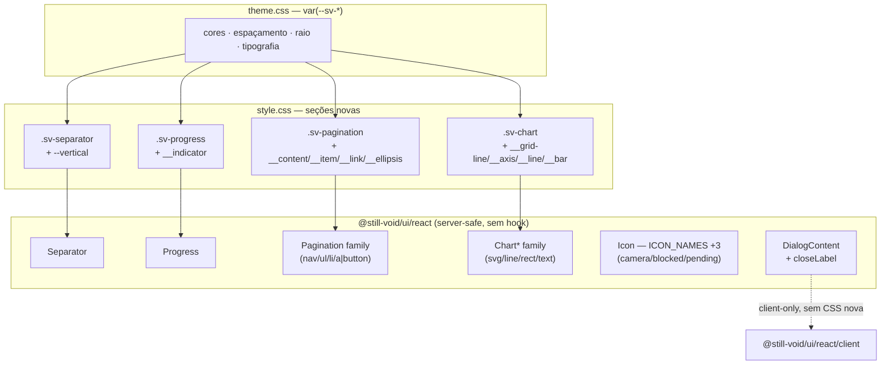

# Rodada 4 — Design

**Spec**: [spec.md](spec.md)
**Status**: Implementado e verificado — mantido como registro histórico das decisões de arquitetura tomadas antes da execução (ver tasks.md para o status corrente).
**Decisões ativas que restringem este design**: AD-001 (CSS `sv-*` real, nunca Tailwind), AD-002 (server-safe por default; hook/Radix só quando nativo não dá conta), AD-005 (foco é `outline`, nunca `box-shadow`), AD-013 (`@heroicons/react/24/outline`, import nomeado), AD-015 (nenhum módulo alcançável do entry server-safe pode conter hook real, nem "morto" — o walker do `server-safety.test.ts` varre o texto-fonte, não o que é chamado).

---

## Architecture Overview

Seis lacunas, nenhuma precisa de estado, foco gerenciado ou portal. Quatro delas são componentes
inteiramente novos que entram em `@still-void/ui/react` (server-safe), ao lado de `Button`/`Card`/`Table`,
seguindo o mesmo padrão hand-rolled + `cn()` + CSS `sv-*` real: `Separator`, `Progress`, a família
`Pagination` e os primitivos `Chart*`. As outras duas são mudanças pontuais em componentes existentes,
não migrações de camada — `IconName` (`icon-set.ts`, já server-safe, ganha 3 valores) e `DialogContent`
(que **continua client-only**, `'use client'` via `shadcn.ts`; `closeLabel` é só uma prop nova na mesma
família Radix, não uma entrada no lado server).

`DialogContent` já é client (`'use client'` via `shadcn.ts`) — `closeLabel` é só uma prop nova, zero CSS nova.
`Icon` já existe — `camera`/`blocked`/`pending` são 3 entradas a mais em `ICON_GLYPHS`/`IconName`, zero componente novo.

## File Map

| Arquivo | Mudança |
| --- | --- |
| `src/components/ui/icon-set.ts` | +3 imports heroicons, +3 entradas `IconName`/`ICON_GLYPHS` |
| `src/components/ui/dialog.tsx` | `DialogContentProps.closeLabel?: string`, default `'Close dialog'` |
| `src/components/ui/separator.tsx` | novo — `Separator` |
| `src/components/ui/progress.tsx` | novo — `Progress` |
| `src/components/ui/pagination.tsx` | novo — `Pagination`, `PaginationContent`, `PaginationItem`, `PaginationLink`, `PaginationPrevious`, `PaginationNext`, `PaginationEllipsis` |
| `src/components/ui/chart.tsx` | novo — `ChartContainer`, `ChartGrid`, `ChartAxis`, `ChartLine`, `ChartBar` |
| `src/css/style.css` | +4 seções: Separator, Progress, Pagination, Chart |
| `src/react/index.ts` | +6 exports (Separator, Progress, Pagination family, Chart family) — `IconName`/`DialogContentProps` já exportados, tipos só crescem |
| `tests/ui-separator.test.tsx`, `ui-progress.test.tsx`, `ui-pagination.test.tsx`, `ui-chart.test.tsx` | novos |
| `tests/ui-icon.test.tsx` | sem mudança de código — loop existente sobre `ICON_NAMES` cobre os 3 novos automaticamente |
| `tests/ui-dialog-behavior.test.tsx` | +casos para `closeLabel` |
| `tests/component-css-contract.test.ts` (ou arquivos novos dedicados) | +seções Separator/Progress/Pagination/Chart |
| `tests/server-safety.test.ts` | sem mudança — walker já cobre qualquer novo export do entry automaticamente |
| `.changeset/*.md` | 1 changeset por componente novo (minor) + 1 para closeLabel (minor) + 1 para IconName (minor) |

## Key Decisions (além da tabela Assumptions do spec)

- **`Pagination` não é um único arquivo monolítico** — 7 membros no mesmo arquivo `pagination.tsx`, mesmo padrão de `table.tsx` (múltiplos componentes relacionados, um arquivo, um export block).
- **`ChartLine`/`ChartBar`/`ChartGrid`/`ChartAxis` não usam `<g>` wrapper próprio** — renderizam direto os elementos SVG filhos (`<polyline>`, `<rect>`, `<line>`, `<text>`) via fragment, porque `ChartContainer` já é o único `<svg>` — evita aninhar `<svg>` dentro de `<svg>` ou grupos vazios sem propósito.
- **`Progress` clamping** (`value` fora de `[0, max]`) é feito no componente, não deixado para o CSS — `Math.min(Math.max(value, 0), max)` antes de calcular `%`, porque um `width: 130%` inline quebraria visualmente sem o clamp.
- **`PaginationLink` decide `<a>` vs `<button>` por presença de `href`**, não por uma prop `as` — mantém a API mínima (2 casos reais, cobertos por 1 prop existente) em vez de introduzir uma terceira opção configurável sem call site.
