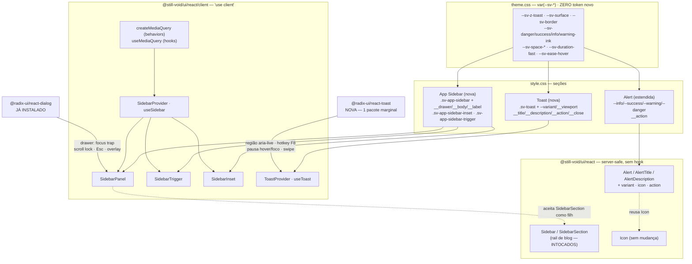

# Rodada 5 (App Shell + Feedback) — Design

**Spec**: [spec.md](spec.md)
**Status**: Draft — aguardando aprovação antes da fase Execute.

**Decisões ativas que restringem este design** (lidas de `.specs/STATE.md`, todas `active`):

| AD | Como restringe esta rodada |
| --- | --- |
| **AD-001** | Toda a estilização é CSS real `sv-*` em `src/css/style.css` lendo `var(--sv-*)`. Zero utilitária Tailwind emitida por qualquer componente novo. |
| **AD-002** | Server-safe por default; Radix só quando o comportamento é impossível sem ele. Aqui: drawer com foco preso e região de toast com ordem de anúncio são exatamente esse caso. `Alert` fica **server-safe** porque é CSS + props. |
| **AD-003** | Precedente direto de **coexistência**: `NativeSelect` × `Select` não se depreciam. `Sidebar` (rail de blog) × `SidebarPanel` (casca de app) seguem o mesmo contrato. |
| **AD-005** | Foco é `outline: 2px solid var(--sv-accent-ink)` com `outline-offset: 2px`. Nenhum `ring-*`, nenhum `box-shadow`. Vale para `SidebarTrigger`, itens do painel, botão de fechar e botão de ação do toast. |
| **AD-007** | Precedente de aceitar custo de dependência quando a lacuna funcional é real (`@radix-ui/react-alert-dialog`). É o mesmo raciocínio aplicado a `@radix-ui/react-toast`, com custo **menor**. |
| **AD-009** | Abrir/fechar anima só com fade de `opacity`, `var(--sv-duration-fast)` + `var(--sv-ease-hover)`, dirigido por `[data-state]`, zerado sob `prefers-reduced-motion`. Nada de slide no drawer, nada de slide no toast. |
| **AD-013** | Ícones vêm de `@heroicons/react/24/outline` via o componente `Icon` e a união `IconName`. **Nenhum nome novo é necessário** — `menu`, `x`, `info`, `check-circle`, `alert-triangle`, `alert-circle` já existem. |
| **AD-014** | Nenhum teste existente precisa de edição nesta rodada (ver Risks). Se surgir a necessidade, a exceção do AD-014 só vale para asserção que pina mecanismo Tailwind — não é o caso aqui. |
| **AD-015** | Nenhum módulo alcançável a partir de `src/react/index.ts` pode conter hook, nem "morto": o walker do `server-safety.test.ts` lê **texto-fonte**, não o que é chamado. É a restrição que determina a topologia inteira deste design. |

---

## Architecture Overview

Três capacidades, três topologias diferentes — e é essa diferença que organiza o design:

- **`Alert` (Grupo C)** é 100% CSS + props. Fica onde já está (`src/components/ui/alert.tsx`),
  continua exportado por `@still-void/ui/react`, continua **server-safe**. Nenhum hook, nenhum
  estado, nenhuma dependência nova.
- **Sidebar de app (Grupo A)** tem estado e precisa de foco preso: nasce inteira em
  `src/react/client/`, no entry `@still-void/ui/react/client`. Reusa `@radix-ui/react-dialog`
  — **já instalado** — para o modo drawer, o que entrega focus trap, scroll-lock, `Escape` e
  overlay sem uma linha nova de código de acessibilidade.
- **Toast (Grupo B)** é inteiramente client: envolve `@radix-ui/react-toast` (**única
  dependência nova da rodada**) com um provider próprio que possui a fila.

A regra que separa os três é a mesma de sempre: o que precisa de browser ou estado vai para
`/react/client`; o resto fica no entry server-safe. O `server-safety.test.ts` prova isso
mecanicamente, sem edição.



---

## Code Reuse Analysis

### Componentes e módulos existentes aproveitados

| O quê | Onde | Como é usado |
| --- | --- | --- |
| `@radix-ui/react-dialog` | `dependencies` (já paga) | Base do drawer off-canvas: `Dialog.Root/Portal/Overlay/Content/Close`. Traz `react-focus-scope`, `react-focus-guards`, `react-remove-scroll` e `aria-hidden` — **verificados presentes em `node_modules`**. Nenhum focus trap escrito à mão. |
| `.sv-overlay` | `src/css/style.css` | O overlay do drawer reusa a classe do Dialog **sem duplicar regra** — mesma cor, mesma opacidade, mesmo fade AD-009 já contratado por `client-css-contract.test.ts`. |
| `SidebarSection` | `src/react/components/Content.tsx` | Agrupador dentro de `SidebarPanel` (A-02). Nada muda nele; é server-safe e composto como `children`. |
| `Icon` + `IconName` | `src/components/ui/icon.tsx`, `icon-set.ts` | `menu` (trigger), `x` (fechar), `info`/`check-circle`/`alert-triangle`/`alert-circle` (severidades de Alert e Toast). **Todos já existem** — zero mudança no set. |
| `cn()` | `src/lib/utils.ts` | Merge de `className`, como em todo componente do catálogo. |
| `sv-sr-only` | `src/css/style.css` | Nome acessível oculto no `SidebarTrigger` e no botão de fechar do toast — mesma técnica de `DialogContent` (R4-02). |
| Padrão `ThemeProvider`/`useTheme` | `src/react/client/ThemeProvider.tsx` | Forma de referência para `SidebarProvider`/`useSidebar` e `ToastProvider`/`useToast`: contexto nullable + `useContext` que lança fora do provider. |
| Padrão `scrollSpy`/`useScrollSpy` | `src/behaviors/scrollSpy.ts` + `src/react/client/hooks.ts` | Forma de referência para `createMediaQuery`/`useMediaQuery`: controlador puro com `subscribe`/`destroy` + hook fino por cima. |
| Padrão de contrato CSS textual | `tests/client-css-contract.test.ts` (parser `section()`) | Reaproveitado literalmente para as seções `App Sidebar` e `Toast`. |

### Pontos de integração

| Sistema | Como conecta |
| --- | --- |
| `src/react/client/index.ts` | Ganha `export * from './SidebarProvider'`, `'./ToastProvider'`, e o `createMediaQuery` na lista de behaviors. |
| `src/react/index.ts` | **Nenhuma mudança de runtime** — `Alert` já é exportado; `variant`/`icon`/`action` são props, e `AlertProps` passa a ser exportado como tipo (apagado em runtime, então `react-barrel.test.ts` continua verde sem edição). |
| `package.json` | `+@radix-ui/react-toast` em `dependencies`. `exports` map **não muda** — nenhum subpath novo. |
| `tests/setup.ts` | Ganha um stub de `window.matchMedia` (jsdom não o implementa). Isso é infraestrutura de teste, não API. |
| `src/css/style.css` | 2 seções novas + extensão da seção `Alert`; blocos `prefers-reduced-motion` das classes novas **no mesmo arquivo, depois da regra base** (contrato existente). |

---

## Components

### `createMediaQuery` — behavior (R5-01)

- **Purpose**: Encapsular `window.matchMedia` como uma fonte externa assinável, sem React.
- **Location**: `src/behaviors/mediaQuery.ts` (novo)
- **Interfaces**:
  - `createMediaQuery(query: string): MediaQueryController`
  - `MediaQueryController = { getSnapshot(): boolean; subscribe(listener: () => void): () => void; destroy(): void }`
- **Dependencies**: nenhuma (só DOM).
- **Reuses**: forma de `createScrollSpy`/`createReadingProgress`.
- **Nota**: quando `window.matchMedia` é indefinido, devolve um controlador inerte
  (`getSnapshot() === false`) em vez de lançar — o mesmo tipo de degradação graciosa que
  `themeManager` já pratica.

### `useMediaQuery` — hook (R5-01)

- **Purpose**: Ler o controlador de dentro do React sem mismatch de hidratação.
- **Location**: `src/react/client/hooks.ts` (estende o arquivo existente)
- **Interfaces**: `useMediaQuery(query: string): boolean`
- **Dependencies**: `createMediaQuery`, `useSyncExternalStore`.
- **Por que `useSyncExternalStore` e não `useEffect`+`useState`**: `useEffect` só roda **depois**
  do commit, então o primeiro render do cliente usa o valor default e o segundo corrige —
  um flash real de layout no modo drawer. `useSyncExternalStore` aceita um
  `getServerSnapshot` (`() => false`, isto é, desktop) que o React usa também no render de
  hidratação, e faz a troca para o valor real no mesmo ciclo, que é o contrato sancionado
  para "fonte externa que o servidor não consegue ler".

### `SidebarProvider` + `useSidebar` (R5-02, R5-03)

- **Purpose**: Possuir o estado aberto/fechado, o modo de colapso e a leitura do breakpoint;
  publicar tudo por contexto e por atributos de dado no DOM.
- **Location**: `src/react/client/SidebarProvider.tsx` (novo)
- **Interfaces**:
  - `SidebarProviderProps = { children; collapsible?: 'offcanvas' | 'icon' | 'none'; defaultOpen?: boolean; open?: boolean; onOpenChange?: (open: boolean) => void; breakpoint?: number }`
  - `useSidebar(): { open: boolean; setOpen(v: boolean): void; toggle(): void; isMobile: boolean; collapsible: SidebarCollapsible; panelId: string }`
- **Dependencies**: `useMediaQuery`, `useId` (para `panelId`, ligando `aria-controls` do trigger
  ao painel — permitido aqui porque é client), `createContext`.
- **Reuses**: forma de `ThemeProvider`.
- **Nota de DOM**: renderiza um `<div class="sv-app-shell" data-state data-collapsible data-mobile>`
  como wrapper. É esse elemento que permite ao `SidebarInset` reagir **por CSS puro** (R5-04
  AC-2), sem prop nem cálculo em JS.

### `SidebarPanel` (R5-02, R5-03)

- **Purpose**: O painel. Estático no fluxo acima do breakpoint; drawer em portal abaixo dele.
- **Location**: `src/react/client/SidebarProvider.tsx` (mesmo arquivo — a família é coesa e
  compartilha o contexto, mesmo critério que colocou os 7 membros de `Pagination` em um arquivo)
- **Interfaces**: `SidebarPanelProps extends ComponentPropsWithoutRef<'aside'> { title?: string }`
  (`title` alimenta o `DialogTitle` obrigatório do Radix no modo drawer; default `'Navigation'`,
  renderizado em `sv-sr-only` — o Radix avisa em console quando falta.)
- **Dependencies**: `useSidebar`, `@radix-ui/react-dialog`.
- **Reuses**: `.sv-overlay`; aceita `SidebarSection` como filho.
- **Uma marcação só**: `children` é passado ao mesmo JSX nos dois modos; o que muda é o
  **contêiner** (aside no fluxo × `Dialog.Content` em portal), nunca a árvore de conteúdo —
  cumprindo a regra do `DESIGN.md` §5 de nunca duplicar nav mobile/desktop.

### `SidebarTrigger` (R5-02)

- **Purpose**: O botão de menu, montável em qualquer lugar da árvore (tipicamente no `Header`).
- **Location**: `src/react/client/SidebarProvider.tsx`
- **Interfaces**: `SidebarTriggerProps extends ComponentPropsWithoutRef<'button'> { label?: string }`
- **Dependencies**: `useSidebar`, `Icon`.
- **Nota**: `aria-expanded` e `aria-controls` são **derivados** e vencem props do consumidor —
  mesma garantia de `aria-modal` em `DialogContent`. Retorna `null` quando
  `collapsible === 'none'` (A-06).

### `SidebarInset` (R5-04)

- **Purpose**: A coluna de conteúdo que acompanha o painel.
- **Location**: `src/react/client/SidebarProvider.tsx`
- **Interfaces**: `SidebarInsetProps extends ComponentPropsWithoutRef<'main'>`
- **Dependencies**: nenhuma além do CSS — deliberadamente **não** lê o contexto. O ajuste vem
  do seletor descendente a partir do `data-state` do wrapper, então o inset é um `<main>` com
  uma classe e nada mais.

### `ToastProvider` + `useToast` (R5-05 → R5-08)

- **Purpose**: Possuir a fila de toasts e renderizar a região/viewport.
- **Location**: `src/react/client/ToastProvider.tsx` (novo)
- **Interfaces**:
  - `ToastProviderProps = { children; duration?: number; max?: number; label?: string; closeLabel?: string; swipeDirection?: 'up'|'down'|'left'|'right' }`
  - `useToast(): { toast(options: ToastOptions): ToastHandle; dismiss(id: string): void; dismissAll(): void; toasts: readonly ToastEntry[] }`
  - `ToastHandle = { id: string; dismiss(): void; update(patch: Partial<ToastOptions>): void }`
- **Dependencies**: `@radix-ui/react-toast`, `Icon`.
- **Divisão de responsabilidade** — o ponto central deste componente: o Radix **não** tem fila.
  `Toast.Provider` só coordena região/anúncio/pausa; quem cria, limita, atualiza e remove
  entradas é o nosso `useReducer`. Portanto o wrapper não é cerimônia: é a metade que faltava.
- **Ciclo de vida de uma entrada**: `toast()` → `dispatch(ADD)` → render de `Toast.Root open`
  → `duration` expira ou usuário dispensa → Radix chama `onOpenChange(false)` →
  `dispatch(REMOVE)`. A remoção da lista é dirigida pelo primitivo, não por um `setTimeout`
  nosso — é o que faz a pausa em hover (R5-05 AC-8) valer de graça, porque o timer que conta
  é o do Radix.

### `Alert` (R5-09, R5-10)

- **Purpose**: Ganhar severidade semântica sem virar client component e sem mudar quem já usa.
- **Location**: `src/components/ui/alert.tsx` (modificado)
- **Interfaces**: `AlertProps extends HTMLAttributes<HTMLDivElement> { variant?: AlertVariant; icon?: ReactNode | null; action?: ReactNode }`,
  `AlertVariant = 'info' | 'success' | 'warning' | 'danger'`
- **Dependencies**: `Icon`, `cn`. **Continua sem hook** — `forwardRef` não é hook, e o arquivo
  já o usa hoje, então o walker do `server-safety.test.ts` continua satisfeito.
- **Reuses**: `.sv-alert > svg` — a regra de posicionamento de ícone **já existe** e serve o
  ícone default sem CSS novo de layout; as classes de variante só injetam a cor.

---

## Data Models

```typescript
// src/react/client/ToastProvider.tsx
export type ToastVariant = 'info' | 'success' | 'warning' | 'danger';

export interface ToastAction {
  label: React.ReactNode;
  /** Required by the primitive: the screen-reader alternative to reaching the
   *  button before auto-dismiss (e.g. "Undo (Alt+U)"). */
  altText: string;
  onClick: () => void;
}

export interface ToastOptions {
  title?: React.ReactNode;
  description?: React.ReactNode;
  variant?: ToastVariant;          // default 'info'
  duration?: number;               // default: provider's, itself 5000
  action?: ToastAction;
}

export interface ToastEntry extends ToastOptions {
  id: string;
}
```

```typescript
// src/react/client/SidebarProvider.tsx
export type SidebarCollapsible = 'offcanvas' | 'icon' | 'none';

export interface SidebarContextValue {
  open: boolean;
  setOpen: (open: boolean) => void;
  toggle: () => void;
  isMobile: boolean;
  collapsible: SidebarCollapsible;
  panelId: string;
}
```

**Mapa `variant` → semântica** (a tabela que Alert e Toast compartilham; é o que faz as duas
famílias falarem a mesma língua, exigência do item 3 do intake):

| `variant` | Token de cor | Ícone (`IconName`) | `Alert` `role` | `Toast` `type` Radix → `aria-live` |
| --- | --- | --- | --- | --- |
| `info` | `--sv-info-ink` | `info` | `status` | `background` → `polite` |
| `success` | `--sv-success-ink` | `check-circle` | `status` | `background` → `polite` |
| `warning` | `--sv-warning-ink` | `alert-triangle` | `alert` | `foreground` → `assertive` |
| `danger` | `--sv-danger-ink` | `alert-circle` | `alert` | `foreground` → `assertive` |
| *(omitido, só `Alert`)* | — (neutro) | nenhum | `alert` *(atual, preservado)* | — |

---

## CSS: classes novas e tokens

**Zero token `--sv-*` novo.** Todas as classes abaixo são adições (`minor`).

| Seção em `style.css` | Classes | Tokens lidos |
| --- | --- | --- |
| `Alert` (estendida) | `.sv-alert--info`, `--success`, `--warning`, `--danger`, `.sv-alert__action` | `--sv-{info,success,warning,danger}-ink` via `--sv-alert-color` local (padrão de `--sv-callout-color`), `--sv-space-*` |
| `App Sidebar` (nova) | `.sv-app-shell`, `.sv-app-sidebar`, `.sv-app-sidebar__drawer`, `__body`, `__label`, `.sv-app-sidebar-inset`, `.sv-app-sidebar-trigger` | `--sv-surface`, `--sv-border`, `--sv-space-*`, `--sv-radius-*`, `--sv-z-modal` (drawer), `--sv-duration-fast`, `--sv-ease-hover`, `--sv-accent-ink` (foco, AD-005) |
| `Toast` (nova) | `.sv-toast`, `.sv-toast--{variant}`, `.sv-toast__viewport`, `__title`, `__description`, `__action`, `__close` | `--sv-z-toast`, `--sv-surface`, `--sv-border`, `--sv-text`, `--sv-text-2`, `--sv-{…}-ink`, `--sv-space-*`, `--sv-radius-md`, `--sv-duration-fast`, `--sv-ease-hover` |

Cada seção animada ganha seu bloco `@media (prefers-reduced-motion: reduce)` **em
`style.css`, depois da regra base** — a especificidade de media query é zero, então o override
em `theme.css` perderia por ordem de documento (é literalmente o bug que
`tests/reduced-motion-contract.test.ts` existe para impedir).

---

## Error Handling Strategy

| Cenário | Tratamento | Impacto no consumidor |
| --- | --- | --- |
| `useSidebar()` / `useToast()` fora do provider | `throw new Error('useSidebar must be used within SidebarProvider')` | Falha imediata e nomeada em dev, igual a `useTheme` — nunca render silenciosamente errado |
| `window.matchMedia` ausente (jsdom sem stub, runtime exótico) | Controlador inerte, `false` | Layout desktop; nada quebra |
| `breakpoint` inválido (`0`, negativo, `NaN`, `Infinity`) | Cai no default 1024 | Comportamento previsível; precedente `Progress`/`max` (R4-04 AC-7) |
| `duration` ≤ 0 ou `NaN` | Cai no default do provider | Toast não some no mesmo frame |
| `duration: Infinity` | Persistente até dispensa explícita | Caso de uso real (erro que exige ação) |
| `max` inválido | Cai no default 3 | — |
| `dismiss(id)` de id inexistente / `dismiss()` duas vezes | No-op silencioso | Handles são seguros de guardar e reusar |
| `toast()` após unmount do provider | No-op (guarda por ref de "montado") | Sem `setState` em componente desmontado |
| `variant` fora da união em runtime | Tratado como omitido | Nenhuma classe `sv-alert--undefined` |
| Cruzar o breakpoint com o drawer aberto | O `Dialog` desmonta; `react-remove-scroll` restaura o scroll no cleanup | Sem `body` travado órfão |

---

## Risks & Concerns

| Concern | Onde | Impacto | Mitigação |
| --- | --- | --- | --- |
| **Dependência nova** `@radix-ui/react-toast` | `package.json` | Custo de instalação e mais uma superfície a acompanhar | Verificado por `npm pack`: as **12** deps transitivas já estão instaladas na versão exata (`react-portal@1.1.17`, `react-presence@1.1.10`, `react-collection@1.1.15`, `react-dismissable-layer@1.1.19`, `react-visually-hidden@1.2.11`, `react-use-controllable-state@1.2.6`, …) → custo marginal de **1 pacote**. Aceitação registrada como **AD-016** (proposto abaixo) |
| **`role="alert"` não é emitido pelo Toast** | arquitetura do primitivo | Diverge da literalidade do intake | Fato verificado no dist (`role: "status"` + `aria-live` comutado). A propriedade que a AT observa é preservada; ACs escritas contra `aria-live`. Documentado em `docs/design-system.md` para não parecer omissão |
| **`--sv-z-toast` já é usado por `.sv-reading-progress`** | `style.css:537` | Toast e barra de leitura na mesma camada (50) | Não é conflito real: a barra é 2px no topo, `pointer-events: none`; o toast fica no canto oposto. Registrado para que ninguém "conserte" um dos dois criando um token novo |
| **`useSyncExternalStore` e cobertura de 100%** | `hooks.ts` | O ramo `getServerSnapshot` não é exercido em jsdom, e um ramo não coberto **reprova o build** | O ramo é testável chamando `createMediaQuery` com `window.matchMedia` deletado + testando o snapshot de servidor diretamente. Task T2 tem isso no `Done when`, não como intenção |
| **Radix Toast e timers falsos** | testes de auto-dismiss | Testes com `vi.useFakeTimers` + `userEvent` são um par notoriamente frágil | Usar `userEvent.setup({ advanceTimers })`; testes de dismiss usam `act` + avanço explícito. Sinalizado na task T7 para não virar descoberta no meio da execução |
| **`tests/setup.ts` ganha stub global de `matchMedia`** | infraestrutura de teste | Um stub global pode mascarar um componente que passe a depender de `matchMedia` sem querer | O stub default responde `matches: false` (desktop) e é sobrescrito por teste quando o caso é mobile — nenhum teste existente muda de resultado, o que a suíte verde comprova |
| **`src/react/client/index.ts` não tem contrato de export pinado** | lacuna de teste preexistente | Um export do client entry pode sumir sem nenhum teste reclamar (o `/react` tem `react-barrel.test.ts`, o client não) | Fora do escopo desta rodada corrigir de forma geral, mas cada família nova pina os **seus** exports no próprio arquivo de teste (T6/T9). Registrado como candidato a task futura |
| **`SidebarPanel` compartilha arquivo com provider/trigger/inset** | `SidebarProvider.tsx` | Arquivo pode passar de 400 linhas (guia de estilo: 200–400 típico) | Precedente de `pagination.tsx` (7 membros) e `table.tsx`. Se passar de ~450 linhas na execução, extrair `SidebarPanel` para arquivo próprio é refactor mecânico e permitido dentro da task |

> Nenhuma concern de segurança: a rodada não toca auth, entrada de usuário persistida, query
> de banco, filesystem, cripto nem chamada externa.

---

## Tech Decisions

| Decisão | Escolha | Racional |
| --- | --- | --- |
| Sidebar de app: estender × família nova | **Família nova** (`SidebarProvider`/`SidebarPanel`/`SidebarTrigger`/`SidebarInset`) | Estender moveria um export server-safe para o client entry = `major`. Coexistência é o precedente literal do AD-003 |
| Base do drawer | `@radix-ui/react-dialog` (já instalado) | Entrega focus trap + scroll-lock + `Esc` + overlay; reusa `.sv-overlay`; zero dependência nova |
| Leitura de breakpoint | `useSyncExternalStore` sobre `matchMedia`, server snapshot = desktop | Única forma sancionada de ler fonte externa sem mismatch de hidratação; `useEffect` produziria flash de layout |
| Base do Toast | `@radix-ui/react-toast` **+ fila própria** | O primitivo entrega a a11y cara (região, ordem de anúncio, pausa, swipe, hotkey F8) e **não** entrega fila; o wrapper entrega a fila. Sob threshold de 100%, a alternativa à mão custaria mais teste |
| Superfície do Toast | Imperativa (`ToastProvider` + `useToast`) | Toast nasce em handler, não em render; expor também os primitivos criaria duas formas de fazer a mesma coisa (anti-referência kitchen-sink) |
| `Alert` sem `variant` | Comportamento atual **byte-a-byte** (`role="alert"`, neutro, sem ícone) | Zero regressão mantém a rodada `minor`; derivar `role` no caso neutro mudaria consumidores que não pediram nada |
| Fundo das variantes de `Alert` | `var(--sv-surface)`, cor só em borda/ícone/título | Não existem tokens `-soft` (verificado); inventá-los seria escolha estética = `major`. É o tratamento que `.sv-callout--*` já usa |
| Recipes para as famílias novas | Nenhuma | A família client existente usa literais em `cn(...)`; mantém `react-barrel.test.ts` intacto (A-17) |
| Nível de bump | **`minor`**, um changeset por família | Só adições: componentes, props e exports novos. Nada removido, nada renomeado, peers inalterados |

### Decisões a promover para `.specs/STATE.md` na fase Execute

Não escritas ainda — este documento é planejamento. Ao iniciar Execute, anexar como
`AD-016` e `AD-017`, **após confirmação do usuário sobre AD-016**:

> **AD-016 (proposta)** — `@radix-ui/react-toast` entra como dependência **direta**. A camada
> de notificação transitória do design system é um wrapper próprio (`ToastProvider` +
> `useToast`, que possuem a fila) sobre o primitivo (que possui região, anúncio, pausa e
> gesto). *Reason*: verificado por inspeção do tarball publicado (`1.2.23`) — as 12 deps
> transitivas já estão instaladas na versão exata, o dist é `'use client'` (logo inalcançável
> pelo walker do `server-safety.test.ts`, ao contrário do `lucide-react` do AD-013 e do `Slot`
> do AD-015) e emite `data-state`, satisfazendo o AD-009 sem regra nova. *Trade-off*: mais um
> pacote a acompanhar, e `role="alert"` deixa de ser alcançável (o primitivo fixa
> `role="status"` e comuta `aria-live`) — a propriedade observável pela AT é preservada.
> *Scope*: camada de feedback transitório e precedente para futuros primitivos Radix
> client-only.

> **AD-017 (proposta)** — Capacidades de **casca de aplicação** (sidebar responsiva, e o que
> vier depois) nascem como **família nova em `/react/client`**, nunca como extensão de um
> componente server-safe homônimo do entry `/react`. Nomes são distintos, não homônimos em
> subpaths diferentes. *Reason*: extensão converteria export server-safe em client = `major`,
> e dois componentes de mesmo nome em entries diferentes é indistinguível no import do
> consumidor. Generaliza o AD-003 (`NativeSelect` × `Select`) do domínio de formulário para o
> de layout. *Scope*: catálogo; decide como toda futura capacidade de app shell entra.

---

## Verificações feitas antes deste design (cadeia de verificação)

1. **Codebase** — `src/react/index.ts` (lista de exports), `src/react/client/index.ts`,
   `src/react/components/Content.tsx` (`Sidebar`/`SidebarSection` reais), `src/components/ui/alert.tsx`,
   `src/components/ui/icon-set.ts` (18 nomes), `src/css/theme.css` (tokens semânticos, escala z),
   `src/css/style.css` (seções Alert/Callout/Dialog/Sidebar), `vitest.config.ts` (threshold 100%),
   `tests/react-barrel.test.ts`, `tests/server-safety.test.ts`, `tests/reduced-motion-contract.test.ts`.
2. **Project docs** — `CLAUDE.md`, `PRODUCT.md`, `DESIGN.md` §4/§5/§6/§7, `.specs/STATE.md`
   (AD-001 → AD-015), rodadas 2–4 (`spec/design/tasks`).
3. **Pacote publicado** — `npm view @radix-ui/react-toast` + `npm pack` do tarball `1.2.23`,
   com inspeção direta de `dist/index.mjs` e `dist/index.d.ts`.

**Nada aqui é suposição sobre API de terceiro.** Os fatos sobre `role`, `aria-live`, `duration`,
`swipeDirection`, hotkey `F8` e `altText` obrigatório vieram da leitura do artefato publicado,
não de memória.
